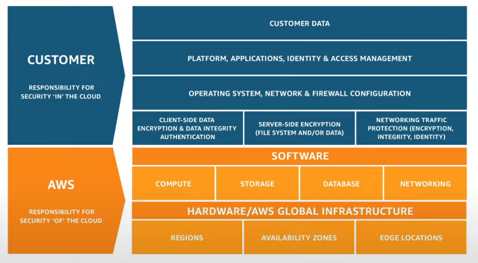

# AWS

AWS est une plateforme regroupant de nombreux services d'hébergement (CPU, Base de données, Fichiers statiques). C'est une Iaas.

[](https://youtu.be/JIbIYCM48to)

## Avantages

- Agilité, augmente l'agilité de l'entreprise
- Modèle de paiement à l'utilisation, echange de l'argent contre du CPU
- Facilite l'agrandissement d'une infrastructure IT d'une entreprise
- Permet d'être atteignable depuis le monde entier en quelques minutes
- Sécurité, à travers le modèle de responsabilité partagé
- Résilience et disponible, performe comme promis par AWS  
- Elasticité, permet d'ajouter ou de supprimer rapidement des ressources automatiquement

 

## Mode d'accès

Chaque mode d'accès dépend de l'utilisation. 

Le site est excellent pour prendre en main les services AWS et configurer les budgets comme il le faut.

L'interface en ligne de commande, permet de gagner du temps en faisant abstraction de la terrible navigation du site. C'est utile si nous voulons aller droit au but. 

C'est en général utilisé pour automatiser des actions/déploiement répétitifs. Cependant, cela demande de la configuration en amont et il faut faire attention où nous persistons notre configuration AWS sur notre machine locale. Le SDK présente les mêmes avantages & inconvénients que le CLI. Il en va de même pour l'utilisation avec Terraform.

### CLI

Pour intéragir avec AWS depuis le terminal. Il faut récupérer un clé d'accès depuis notre session connectée sur le site.
Il faut cliquer sur notre compte en haut à droite et aller dans __Informations d'identification de sécurité__ ou dans le service __IAM__.

Ensuite, il vous reste plus qu'à installer le CLI

```sh
$ curl "https://awscli.amazonaws.com/awscli-exe-linux-x86_64.zip" -o "awscliv2.zip"
unzip awscliv2.zip
sudo ./aws/install
```

Si vous l'avez déjà sur votre machine locale mais que le client n'est pas à jour, vous pouvez le mettre à jour comme ceci

```sh
$ sudo ./aws/install --bin-dir /usr/local/bin --install-dir /usr/local/aws-cli --update
```

Puis, vérifiez que le client est bien installé et trouvable dans le terminal

```sh
$ aws --version
```

Enfin, on configure avec la clé d'accès générée.

```sh
$ aws configure
```

Si vous rencontrez des soucis de configuration et qui vous avez un besoin urgent d'utiliser le CLI, vous pouvez regarder le service [CloudShell](https://eu-west-3.console.aws.amazon.com/cloudshell/home?region=eu-west-3#) qui pré-configuré et possède même des langages de programmation installé.

Si vous avez besoin d'informations plus poussés concernant le CLI d'AWS, je vous encourage à aller visiter la documentation décrivant chaque commande et sous-commande [ici](https://docs.aws.amazon.com/cli/latest/index.html).

Il existe une autocomplétion possible dans votre terminal, la configuration est expliquée [ici](https://docs.aws.amazon.com/cli/latest/userguide/cli-configure-completion.html#cli-command-completion-linux).

### Terraform

TODO

## IAM

TODO

## S3

S3 est un serveur de fichiers qui permet de stocker à distance des fichiers plats. On peut copier, déplacer et supprimer de manière bidirectionnel.
Il est très souvent utilisé pour stocker des fichiers média en tout genre ou des configurations.

```sh title="Intéractions avec le CLI"
$ aws s3api create-bucket --bucket arichard --region us-east-1 # (1)
{
    "Location": "/arichard"
}

$ aws s3 cp mkdocs.yml s3://arichard/mkdocs.yml # (2)
upload: ./mkdocs.yml to s3://arichard/mkdocs.yml  

$ aws s3 cp s3://arichard/mkdocs.yml mkdocs2.yml # (3)
download: s3://arichard/mkdocs.yml to ./mkdocs2.yml

$ rm mkdocs2.yml && aws s3 rm s3://arichard/mkdocs.yml # (4)
delete: s3://arichard/mkdocs.yml

$ aws s3api delete-bucket --bucket arichard # (5)
```

1. On créer un bucket S3 en lui fournissant le nom. Il n'y que la région us-east-1 qui supporte les buckets s3 pour le moment.
2. On copie un fichier local vers le S3 en lui fournissant le chemin cible.
3. On télécharge un fichier sur le S3 avec son chemin et l'endroit où nous voulons le persister sur la machine locale.
4. On supprime le fichier local téléchargé et le fichier distant.
5. On supprime le S3 en lui fournissant le nom.

## EC2

EC2 est un service de création de machine virtuelle en cloud. (Elastic Cloud Computing)

Il est "élastique" car on peut moduler ses composants en fonction du besoin (CPU, RAM, Stockage, Réseau). Il existe des configurations par défaut
que nous pouvons utiliser appelé AMI (Amazon Machine Image).

### Créer une instance

### Afficher les méta-données des instances

### Modifier une instance déjà créée

### Faire communiquer deux instances entre-elles

### Nettoyer les ressources

TODO

## Scaling

AWS propose deux manières du supporter la charge entrante. Il y a :

- Auto scaling groups,
- ELB (Elastic Load Balancer)

### Auto scaling groups

Un groupe échelonne horizontalement les ressources en fonction d'un critère donné (exemple: créer une nouvelle instance si le CPU dépasse 80% d'utilisation).
Un groupe permet de définir un nombre minimum, désiré et maximum d'instances répliquées.

### EJB

Un EJB absorbe la charge la répartissant afin d'obtenir la plus faible latence. Il existe deux types de load balancer: applicatif et réseau.
l'EJB applicatif sert à répartir le traffic sur plusieurs EC2 tandis que l'EJB Réseau absorbe en amont le traffic réseau.

TODO

## EBS

TODO

## RDS

TODO

## DynamoDB

TODO

## Lambda

### Déployer une Lambda sous forme de conteneur Docker

### Paramétrer les autorisations de la fonction

### Nettoyer les ressources

TODO

## SQS & SNS

TODO

## CloudWatch

### Créer un groupe de log

### Créer ses propres KPI

### Créer des alarmes 

### Mettre en place un workflow de monitoring

### Nettoyer les ressources

TODO

## API Gateway

TODO"

## ECR

TODO

## Kubernetes

TODO
