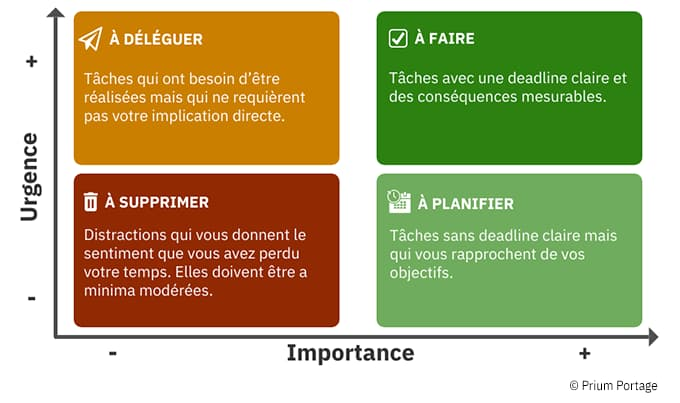

# Matrice d'eisenhower

Quand on est seul dans une équipe pendant les vacances ou que c'est le chaos total d'un point de vue organisationnel. Il est important de ne pas se décourager et catégoriser les tâches pour ne pas s'éparpiller. Sinon on arrive à rien et on fait du multi-tasking sans jamais arriver à la fin de chaque tâche. 

Ce tableau permet de visualiser rapidement quelles sont les tâches qui méritent toute notre attention. Il est important de prendre le temps de bien catégoriser les tâches pour éviter les ratés. 

Aussi, être accompagné d'un PO ou du client permet d'éviter le biais dans la catégorisation et rester aligné avec les objectifs.

